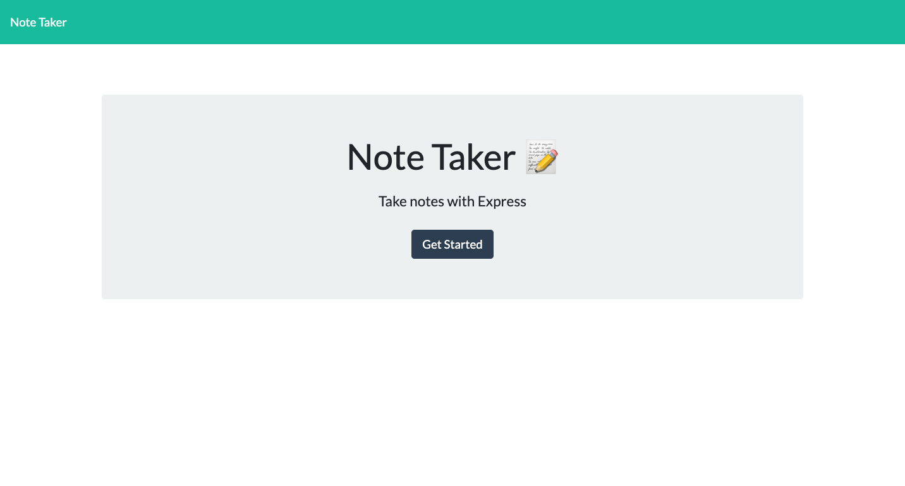

# Note Taker 

## Description
An application called Note Taker that can be used to write and save notes. This application usew an 
Express.js back end and will save and retrieve note data from a JSON file.

## User Story
`AS A small business owner
I WANT to be able to write and save notes
SO THAT I can organize my thoughts and keep track of tasks I need to complete`

## Acceptance Criteria
>GIVEN a note-taking application\
>WHEN I open the Note Taker\
>THEN I am presented with a landing page with a link to a notes page\
>WHEN I click on the link to the notes page\
>THEN I am presented with a page with existing notes listed in the left-hand column, plus empty fields to enter a new note title and the note’s text in the right-hand column\
>WHEN I enter a new note title and the note’s text\
>THEN a Save icon appears in the navigation at the top of the page\
>WHEN I click on the Save icon\
>THEN the new note I have entered is saved and appears in the left-hand column with the other existing notes\
>WHEN I click on an existing note in the list in the left-hand column\
>THEN that note appears in the right-hand column\
>WHEN I click on the Write icon in the navigation at the top of the page\
>THEN I am presented with empty fields to enter a new note title and the note’s text in the right-hand column\`

## Usage
To use this application, go to the the deployed site here: [Note Taker](https://note-taker1991.herokuapp.com/).\
Press `Get Started` and click on `Note title` and `Note text` to write your own note. Press the `Save` icon to save, and the `trash` icon to delete. 

## Tech Used
* Node.js
* Express.js
* JavaScript
* Heroku
* Insomnia Core

## Credits 
Big thanks to my tutor and the instructional staff at UPenn LPS Coding Bootcamp!

